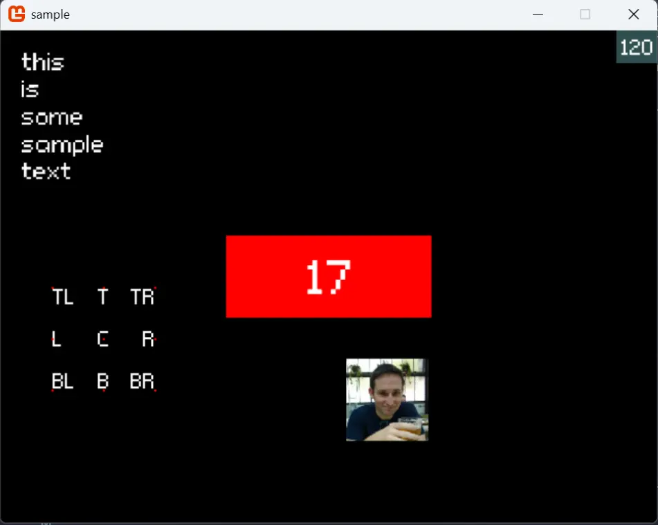

# fsharp-gamecore

 

A fleshed-out game loop from MonoGame with supporting classes, intended to be used as the core loop of larger games.

This is for **2D games only**, i.e. those that use 2d textures like sprites and raw colours. It also supports sounds, music and fonts.

Designed so that all XNA bits and necessary mutable fields are wrapped inside the internal `GameLoop` class, allowing a parent application to remain purely functional and almost game engine agnostic. Entry point is the `runGame` method from the GameRunner module.

## Samples

In this repository (or if you follow the repo url, if using Nuget), there is a samples folder containing a simple game demonstrating the use of the various hooks. For more advanced usage, check other projects on my Github. DungeonRaider (<https://github.com/ChrisPritchard/DungeonRaider>) uses this repo, for example.

> In this animation image the framerate is not preserved, but the number in the top left is the real framerate that was recorded.

## License

Provided under **MIT** (except for the font, see below). Previously it was Unilicense, but I need to use some code downstream thats MIT so this is easier. Hopefully this isn't a problem for anyone.

## Font and its License

The sample project includes a font that is compiled by the monogame pipeline. The font used is 'Connection', from here: <https://fontlibrary.org/en/font/connection>

This font is provided under the **SIL Open Font License**, a copy of which lies in the root of this repository.

## Version History

### Updates for 1.0.0

Bumped version of dotnet and other packages, refreshed readme etc, added github actions for build and release.

Now using Monogame 3.8.4, which required a little migration.

### Updates for 0.0.8

The framerate was uncapped, and the way fps is calculated fixed to be more accurate. Finally, a member was added to GameLoop allowing access to the loaded texture asset map (again for use by FG-ImGui)

### Updates for 0.0.7

The ability to show the mouse cursor was added, but primarily 0.0.7 was about exposing the game loop class so that other projects that need to override it can do so (e.g. FSharp-GameCore-ImGui)

### Updates for 0.0.6

The previous iteration with its destRects didn't work out: the size of the text became constrained, but unpredictable in practice. 0.0.6 has changed this back to the old signature, but with font height in pixels instead of scale. This works much better.

Another, minor change is that the origins for text drawing have been expanded to centre plus all eight points of the compass. This is where the text will be drawn from relative to its given position, and an example of this is in the sample project.

### Updates for 0.0.5

The way text is drawn has changed in a breaking way, but for the better: instead of specifying position, origin and scale, with the last being basically trial and error based on how the font was specified, you instead specify a destination rect and a alignment within that rect. The scale is dynamically calculated to ensure the text can fit inside that rect, and then adjustments are made based on alignment.

This makes text drawing more accurate and easy, while also aligning the specification of text view artifacts with the way images and colours are specified (which also just take rects). This also fixes a bug where drawing centre-aligned text at lower scales would not be centred properly, and it now trims off extra line spacing gaps at the bottom of text.

0.0.5 also includes:

- the ability to draw multiline text via Paragraph (as compared to text, and which takes a string list of lines)
- a simplified game runner 'runWindowedGame' that takes a window size and asset list instead of a config object, and defaults to aliceBlue for clear colour and no fpsCounter

### Updates for 0.0.4 vs 0.0.3

I've reworked so the meta config of the game is buried in a record type, and so the entry to the game is via a functional method (no more use of the ugly class).
